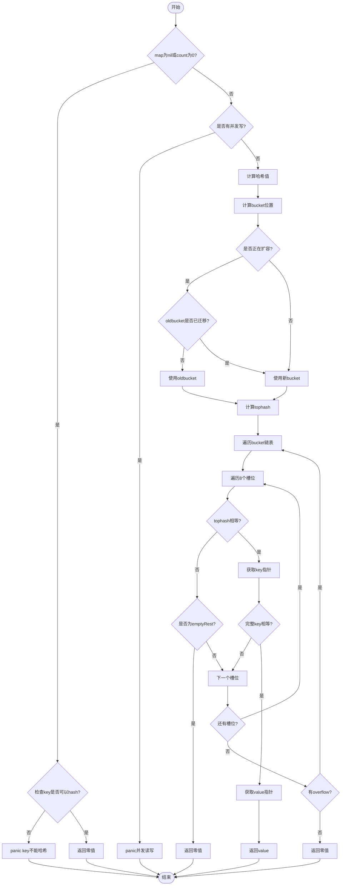
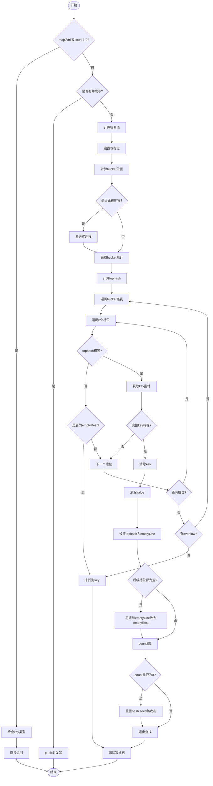
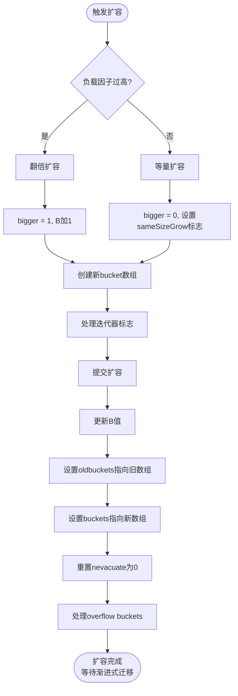

+++
title = 'Map_noswiss'
date = 2025-11-03T15:33:10+08:00
draft = true
tags = ['golang']
mermaid = true
+++

以下代码为 golang 1.25.3


## map_noswiss

### 常量

```go
const (
	// 每个 bucket 能够容纳的最大 key/val 的数量
	bucketCntBits = abi.OldMapBucketCountBits

    // 当桶的平均装载量（load factor）超过 13/16 = 0.8125 时，会触发 map 扩容。
    // 因为 bucketCnt 至少是 8，所以在对齐规则下性能是合理的。
    // 这里用两个整数（分子 / 分母）来避免使用浮点数计算。
	loadFactorDen = 2
	loadFactorNum = loadFactorDen * abi.OldMapBucketCount * 13 / 16

    // map 桶（bmap）结构中数据区（keys、values）相对于结构体起始地址的偏移量。
    // 即 bmap 头部之后，键值对数据的起始位置。
    // 为保证对齐，在某些架构（如 amd64p32）上，即使指针是 32 位，也要使用 64 位对齐。
	dataOffset = unsafe.Offsetof(struct {
		b bmap
		v int64
	}{}.v)

	emptyRest      = 0 // 这个槽为空，并且后面不会再有非空项（用于快速扫描结束）
	emptyOne       = 1 // 这个槽为空，但后面可能还有数据
	evacuatedX     = 2 // 此键值对已经迁移到新表（新表前一半）
	evacuatedY     = 3 // 此键值对已迁移到新表（新表后一半）
	evacuatedEmpty = 4 // 桶已迁移完成，此槽为空
	minTopHash     = 5 // 正常已填充槽的最小 tophash 值

	// flags
	iterator     = 1 // 有迭代器正在使用当前 buckets
	oldIterator  = 2 // 有迭代器正在使用旧的 old buckets（扩容时）
	hashWriting  = 4 // 有 goroutine 正在写 map（防止并发写入）
	sameSizeGrow = 8 // 当前 map 扩容时，新旧 map 大小相同（即仅搬迁，不扩容）

    // 这是迭代器检查时的特殊哨兵值（bucket ID），
    // 用于标识“不需要检查”的情况。
    // 1<<(8*goarch.PtrSize)-1 表示在当前平台下（32 或 64 位）能表示的最大无符号整数。
	noCheck = 1<<(8*goarch.PtrSize) - 1
)

```

### 部分函数
```go
// 判断是否迁移完毕
func evacuated(b *bmap) bool {
	h := b.tophash[0]
	return h > empty && h < minTopHash
}

// 渐进式扩容
func growWork(t *maptype, h *hmap, bucket uintptr) {
	// make sure we evacuate the oldbucket corresponding
	// to the bucket we're about to use
	evacuate(t, h, bucket&h.oldbucketmask())

	// evacuate one more oldbucket to make progress on growing
	if h.growing() {
		evacuate(t, h, h.nevacuate)
	}
}

func isEmpty(x uint8) bool {
	return x <= emptyOne
}

// overLoadFactor reports whether count items placed in 1<<B buckets is over loadFactor.
func overLoadFactor(count int, B uint8) bool {
	return count > abi.OldMapBucketCount && uintptr(count) > loadFactorNum*(bucketShift(B)/loadFactorDen)
}

```

### 底层结构
```go
// map head 结构体
type hmap struct {
	count     int // map 元素的数量
	flags     uint8
	B         uint8  // 表示 有 2^B 个桶（能存储 loadFactor * 2^B 个元素）
	noverflow uint16 // 溢出桶的大约数量
	hash0     uint32 // hash seed

	buckets    unsafe.Pointer // 桶的数组，如果桶数量为0，必须是 nil
	oldbuckets unsafe.Pointer // 扩容前的桶数组，如果不是 nil 表示正在扩容
	nevacuate  uintptr        // 已迁移完成的 bucket 数量
	clearSeq   uint64

	extra *mapextra // optional fields
}

// mapextra holds fields that are not present on all maps.
type mapextra struct {
    // 当 map 的 key 和 value 都不是指针，并且 size 都小于 128 字节的情况下，
    // 会把 bmap 标记为不含指针，这样可以避免 gc 时扫描整个 hmap。
    // 但是，我们看 bmap 其实有一个 overflow 的字段，是指针类型的，
    // 破坏了 bmap 不含指针的设想，这时会把 overflow 移动到 extra 字段来。
	overflow    *[]*bmap
	oldoverflow *[]*bmap

	// nextOverflow holds a pointer to a free overflow bucket.
	nextOverflow *bmap
}

// go map bucket 结构体（隐藏版）
type bmap struct {
    // 正常情况下：tophash[i] = hash(key) >> (hashBits - 8)（取哈希值的最高 8 位）。
	// 特殊情况下（如扩容时搬迁）：tophash[i] 也可能被用作“状态标记”。
    // 用于预比较
	tophash [abi.OldMapBucketCount]uint8
	// Followed by bucketCnt keys and then bucketCnt elems.
	// NOTE: packing all the keys together and then all the elems together makes the
	// code a bit more complicated than alternating key/elem/key/elem/... but it allows
	// us to eliminate padding which would be needed for, e.g., map[int64]int8.
	// Followed by an overflow pointer.
}

// go map bucket 结构体（完全版）
type bmap struct {
	tophash [abi.OldMapBucketCount]uint8
    keys     [8]keytype
    values   [8]valuetype
    pad      uintptr
    overflow uintptr
}

```

### read map

#### mapaccess1 读取流程图



#### 源码解析

```go
// val := m[key] 形式读 map
// 不会返回 空指针，尽管 key 不存在或 map == nil（返回零值）
func mapaccess1(t *maptype, h *hmap, key unsafe.Pointer) unsafe.Pointer {
    // ...
	if h == nil || h.count == 0 {
        // 函数里面判断 hash func panic
		if err := maps.OldMapKeyError(t, key); err != nil {
			panic(err) // see issue 23734
		}
        // 返回零值
		return unsafe.Pointer(&zeroVal[0])
	}
    // 读正在写的 map panic
	if h.flags&hashWriting != 0 {
		fatal("concurrent map read and map write")
	}
    // 计算哈希值，并且加入 hash0 引入随机性
	hash := t.Hasher(key, uintptr(h.hash0))
	m := bucketMask(h.B) // 1<<h.B -1, 比如 h.B = 5, 计算出 m = 32-1 = 31
    // 计算 bucket 地址
	b := (*bmap)(add(h.buckets, (hash&m)*uintptr(t.BucketSize)))
    // 说明发生了扩容
	if c := h.oldbuckets; c != nil {
        // 不同 size 扩容，bucket 是之前的 2倍
        // 原来的 m 为现在 m 的一半
		if !h.sameSizeGrow() {
			// There used to be half as many buckets; mask down one more power of two.
			m >>= 1
		}
        // key 在原 bucket 的位置
		oldb := (*bmap)(add(c, (hash&m)*uintptr(t.BucketSize)))
		if !evacuated(oldb) {
			b = oldb
		}
	}
	top := tophash(hash)
bucketloop:
    // 遍历 bucket 以及 overflow bucket
	for ; b != nil; b = b.overflow(t) {
        // 遍历 bucket 的 key
		for i := uintptr(0); i < abi.OldMapBucketCount; i++ {
			if b.tophash[i] != top {
				if b.tophash[i] == emptyRest {
					break bucketloop
				}
				continue
			}
            // 计算 key 的指针
			k := add(unsafe.Pointer(b), dataOffset+i*uintptr(t.KeySize))
            // key 是指针，需要把 key 解引用
			if t.IndirectKey() {
				k = *((*unsafe.Pointer)(k))
			}
            // key 相等
			if t.Key.Equal(key, k) {
				e := add(unsafe.Pointer(b), dataOffset+abi.OldMapBucketCount*uintptr(t.KeySize)+i*uintptr(t.ValueSize))
				if t.IndirectElem() {
					e = *((*unsafe.Pointer)(e))
				}
				return e
			}
		}
	}
	return unsafe.Pointer(&zeroVal[0])
}


func mapaccess2(t *maptype, h *hmap, key unsafe.Pointer) (unsafe.Pointer, bool) {
    // 此处省略，只是在 macaccess1 上新增了 bool 返回，表明是否有 key
}
```

#### 关键点说明

1. **nil map 读取**：
   - 如果 key 类型合法（可比较类型），读取 nil map 返回零值，不会 panic
   - 如果 key 类型不合法（slice、map、function 等），会先检查并 panic
2. **并发读写检测**：通过 `hashWriting` 标志检测并发读写，发现则 panic
3. **扩容期间的读取**：优先从旧 bucket 读取未迁移的数据，保证数据不丢失
4. **两级查找优化**：先比较 tophash（高 8 位），再比较完整 key，减少比较次数
5. **emptyRest 优化**：遇到 emptyRest 标记可提前终止查找，提升性能
6. **零值返回**：找不到 key 时返回类型的零值，而非 nil 指针

### write map

#### mapassign 写入流程图

```mermaid
flowchart TD
    Start([开始]) --> CheckNil{map为nil?}
    CheckNil -->|是| Panic1[panic]
    
    CheckNil -->|否| CheckWriting{是否有并发写?}
    CheckWriting -->|是| Panic2[panic并发写]
    
    CheckWriting -->|否| CalcHash[计算哈希值]
    CalcHash --> SetFlag[设置写标志]
    
    SetFlag --> CheckBuckets{buckets为空?}
    CheckBuckets -->|是| CreateBucket[创建bucket]
    CheckBuckets -->|否| CalcBucket[计算bucket位置]
    CreateBucket --> Again[again标签]
    
    Again --> CalcBucket
    CalcBucket --> CheckGrowing{是否正在扩容?}
    CheckGrowing -->|是| GrowWork[渐进式迁移]
    CheckGrowing -->|否| GetBucket[获取bucket指针]
    GrowWork --> GetBucket
    
    GetBucket --> CalcTopHash[计算tophash]
    CalcTopHash --> InitVars[初始化插入位置]
    
    InitVars --> LoopBucket[遍历bucket链表]
    LoopBucket --> LoopSlot[遍历8个槽位]
    
    LoopSlot --> CompareTopHash{tophash相等?}
    CompareTopHash -->|否| CheckEmpty{槽位为空?}
    CheckEmpty -->|是且未记录| RecordSlot[记录空槽位]
    CheckEmpty -->|否| CheckEmptyRest{是否为emptyRest?}
    CheckEmptyRest -->|是| ExitLoop[退出循环]
    CheckEmptyRest -->|否| NextSlot1[下一个槽位]
    RecordSlot --> NextSlot1
    
    CompareTopHash -->|是| GetKey[获取key指针]
    GetKey --> CompareKey{完整key相等?}
    CompareKey -->|否| NextSlot1
    CompareKey -->|是| UpdateKey[更新key]
    UpdateKey --> GetElem[获取elem指针]
    GetElem --> Done[跳转done]
    
    NextSlot1 --> MoreSlots{还有槽位?}
    MoreSlots -->|是| LoopSlot
    MoreSlots -->|否| CheckOverflow{有overflow?}
    CheckOverflow -->|是| LoopBucket
    CheckOverflow -->|否| ExitLoop
    
    ExitLoop --> CheckNeedGrow{需要扩容?}
    CheckNeedGrow -->|是且未扩容| HashGrow[触发扩容]
    HashGrow --> Again
    
    CheckNeedGrow -->|否| CheckInserti{inserti为空?}
    CheckInserti -->|是| NewOverflow[创建overflow]
    CheckInserti -->|否| PrepareInsert[准备插入]
    NewOverflow --> PrepareInsert
    
    PrepareInsert --> CheckIndirectKey{key间接存储?}
    CheckIndirectKey -->|是| AllocKey[分配key空间]
    CheckIndirectKey -->|否| CheckIndirectElem{value间接存储?}
    AllocKey --> CheckIndirectElem
    
    CheckIndirectElem -->|是| AllocElem[分配value空间]
    CheckIndirectElem -->|否| CopyKey[拷贝key]
    AllocElem --> CopyKey
    
    CopyKey --> SetTopHash[设置tophash]
    SetTopHash --> IncCount[count加1]
    IncCount --> Done
    
    Done --> CheckFlag{写标志还在?}
    CheckFlag -->|否| Panic3[panic并发写]
    CheckFlag -->|是| ClearFlag[清除写标志]
    ClearFlag --> ReturnElem[返回elem指针]
    
    ReturnElem --> End([结束])
    Panic1 --> End
    Panic2 --> End
    Panic3 --> End
```



#### 源码解析

```go
func mapassign(t *maptype, h *hmap, key unsafe.Pointer) unsafe.Pointer {
	// nil map 写直接 panic
	if h == nil {
		panic(plainError("assignment to entry in nil map"))
	}
	// ...
	// 写正在写的 map panic
	if h.flags&hashWriting != 0 {
		fatal("concurrent map writes")
	}
	hash := t.Hasher(key, uintptr(h.hash0))

	// 在调用 t.hasher 之后再设置 hashWriting 标志
	// 因为如果 t.hasher 发生 panic，其实没有真正进行写操作。
	h.flags ^= hashWriting

	// buckets 为空，创建新的 bucket
	if h.buckets == nil {
		h.buckets = newobject(t.Bucket) // newarray(t.Bucket, 1)
	}

again:
	// 计算 bucket 地址，使用 hash 的低 B 位
	bucket := hash & bucketMask(h.B)
	// 如果正在扩容，则将旧 bucket 内容迁移到新 bucket
	// 也就是 渐进式扩容
	if h.growing() {
		growWork(t, h, bucket)
	}
	b := (*bmap)(add(h.buckets, bucket*uintptr(t.BucketSize)))
	top := tophash(hash)

	var inserti *uint8
	var insertk unsafe.Pointer
	var elem unsafe.Pointer
bucketloop:
	for {
		for i := uintptr(0); i < abi.OldMapBucketCount; i++ {
			// tophash 不同
			if b.tophash[i] != top {
				// 如果是空的 cell 且还没有找到可插入位置，则记录当前槽为未来的插入点
				if isEmpty(b.tophash[i]) && inserti == nil {
					inserti = &b.tophash[i]
					insertk = add(unsafe.Pointer(b), dataOffset+i*uintptr(t.KeySize))
					elem = add(unsafe.Pointer(b), dataOffset+abi.OldMapBucketCount*uintptr(t.KeySize)+i*uintptr(t.ValueSize))
				}
				// 表示从当前槽开始到桶末尾都没有存任何 key。
				// 直接退出循环
				if b.tophash[i] == emptyRest {
					break bucketloop
				}
				continue
			}
			k := add(unsafe.Pointer(b), dataOffset+i*uintptr(t.KeySize))
			if t.IndirectKey() {
				k = *((*unsafe.Pointer)(k))
			}
			// tophash 相同，但是全 hash 不同
			if !t.Key.Equal(key, k) {
				continue
			}
			// hash 相同，更新
			if t.NeedKeyUpdate() {
				typedmemmove(t.Key, k, key)
			}
			elem = add(unsafe.Pointer(b), dataOffset+abi.OldMapBucketCount*uintptr(t.KeySize)+i*uintptr(t.ValueSize))
			goto done
		}
		ovf := b.overflow(t)
		if ovf == nil {
			break
		}
		b = ovf
	}

	// 走到这里说明 bucket 里没有这个 key

	// 达到最大扩容因子，或者太多 overflow buckets
	// 并且没有正在扩容的情况下，扩容
	if !h.growing() && (overLoadFactor(h.count+1, h.B) || tooManyOverflowBuckets(h.noverflow, h.B)) {
		hashGrow(t, h)
		goto again // Growing the table invalidates everything, so try again
	}

	if inserti == nil {
		// 前面遍历了当前 bucket 和所有 overflow bucket 都找不到空位
		newb := h.newoverflow(t, b)
		inserti = &newb.tophash[0]
		insertk = add(unsafe.Pointer(newb), dataOffset)
		elem = add(insertk, abi.OldMapBucketCount*uintptr(t.KeySize))
	}

	if t.IndirectKey() {
		// 间接存储：大对象，存储一个指针，指向堆上分配的对象。
		kmem := newobject(t.Key)
		*(*unsafe.Pointer)(insertk) = kmem
		insertk = kmem
	}
	if t.IndirectElem() {
		// 间接存储：大对象，存储一个指针，指向堆上分配的对象。
		vmem := newobject(t.Elem)
		*(*unsafe.Pointer)(elem) = vmem
	}
	// 拷贝 key/val
	typedmemmove(t.Key, insertk, key)
	// 设置 tophash（高位哈希字节），用于加速后续查找
	*inserti = top
	h.count++

done:
	// hashWriting 标志位被清除
	// 说明另外一个 goroutine 正在写，这时也会 panic
	if h.flags&hashWriting == 0 {
		fatal("concurrent map writes")
	}
	// 清除写标志
	h.flags &^= hashWriting
	if t.IndirectElem() {
		elem = *((*unsafe.Pointer)(elem))
	}
	return elem
}

```

#### 关键点说明

1. **nil map 写入 panic**：向 nil map 写入会直接 panic，与读取不同
2. **并发写保护**：通过 `hashWriting` 标志保护并发写，写入前设置，完成后清除
3. **渐进式扩容**：每次写入时触发最多 2 个旧 bucket 的迁移，分摊扩容成本
4. **两种扩容触发条件**：
   - 负载因子过高（元素数量 / bucket 数量 > 6.5）
   - overflow bucket 过多（说明哈希分布不均）
5. **预留插入位置**：遍历时记录第一个空槽位，找不到 key 时直接使用
6. **间接存储优化**：大对象（> 128 字节）通过指针间接存储，减少数据拷贝
7. **原子性保证**：写入完成前后都检查 `hashWriting` 标志，确保操作原子性

### for range map

#### 迭代器结构

```go
// map 迭代器
type hiter struct {
	key         unsafe.Pointer // 当前迭代的 key
	elem        unsafe.Pointer // 当前迭代的 value
	t           *maptype
	h           *hmap
	buckets     unsafe.Pointer // 迭代器开始时的 bucket 指针
	bptr        *bmap          // 当前 bucket
	overflow    *[]*bmap       // 保持 overflow buckets 存活
	oldoverflow *[]*bmap       // 保持旧的 overflow buckets 存活
	startBucket uintptr        // 迭代开始的 bucket 编号
	offset      uint8          // bucket 内随机起始位置（实现无序遍历）
	wrapped     bool           // 是否已经遍历回到起始 bucket
	B           uint8
	i           uint8          // 当前在 bucket 内的位置
	bucket      uintptr        // 当前遍历的 bucket 编号
	checkBucket uintptr        // 扩容时需要检查的 bucket
}
```

#### 源码解析

```go
// for range map 的核心实现
func mapiternext(it *hiter) {
	h := it.h
	// ...
	// 并发检查：遍历时禁止写入
	if h.flags&hashWriting != 0 {
		fatal("concurrent map iteration and map write")
	}
	
	t := it.t
	bucket := it.bucket    // 当前 bucket 编号
	b := it.bptr          // 当前 bucket 指针
	i := it.i             // 当前在 bucket 内的索引
	checkBucket := it.checkBucket

next:
	// 如果当前 bucket 为空，获取下一个 bucket
	if b == nil {
		// 判断是否遍历完成：回到起始 bucket 且已标记 wrapped
		if bucket == it.startBucket && it.wrapped {
			// 遍历结束
			it.key = nil
			it.elem = nil
			return
		}
		
		// 处理扩容中的情况
		if h.growing() && it.B == h.B {
			// 迭代器在扩容过程中启动，需要从旧 bucket 中读取
			oldbucket := bucket & it.h.oldbucketmask()
			b = (*bmap)(add(h.oldbuckets, oldbucket*uintptr(t.BucketSize)))
			// 如果旧 bucket 还没迁移，从旧 bucket 读取
			if !evacuated(b) {
				checkBucket = bucket
			} else {
				// 已迁移，从新 bucket 读取
				b = (*bmap)(add(it.buckets, bucket*uintptr(t.BucketSize)))
				checkBucket = noCheck
			}
		} else {
			// 正常情况，直接从新 bucket 读取
			b = (*bmap)(add(it.buckets, bucket*uintptr(t.BucketSize)))
			checkBucket = noCheck
		}
		
		// 移动到下一个 bucket
		bucket++
		if bucket == bucketShift(it.B) {
			// 遍历完所有 bucket，回到起点
			bucket = 0
			it.wrapped = true
		}
		i = 0
	}
	
	// 遍历当前 bucket 的 8 个槽位
	for ; i < abi.OldMapBucketCount; i++ {
		// 使用 offset 实现随机起始位置，保证遍历无序性
		offi := (i + it.offset) & (abi.OldMapBucketCount - 1)
		
		// 跳过空槽位
		if isEmpty(b.tophash[offi]) || b.tophash[offi] == evacuatedEmpty {
			continue
		}
		
		// 获取 key 指针
		k := add(unsafe.Pointer(b), dataOffset+uintptr(offi)*uintptr(t.KeySize))
		if t.IndirectKey() {
			k = *((*unsafe.Pointer)(k))
		}
		
		// 获取 value 指针
		e := add(unsafe.Pointer(b), dataOffset+abi.OldMapBucketCount*uintptr(t.KeySize)+uintptr(offi)*uintptr(t.ValueSize))
		
		// 扩容期间的特殊处理：判断该 key 是否属于当前新 bucket
		if checkBucket != noCheck && !h.sameSizeGrow() {
			// 扩容时，旧 bucket 会分裂成两个新 bucket
			// 需要判断当前 key 是否应该分配到当前的新 bucket
			if t.ReflexiveKey() || t.Key.Equal(k, k) {
				// 计算 key 应该去的新 bucket
				hash := t.Hasher(k, uintptr(h.hash0))
				if hash&bucketMask(it.B) != checkBucket {
					continue // 不属于当前 bucket，跳过
				}
			} else {
				// 处理 NaN 等特殊情况（key != key）
				// 使用 tophash 的低位决定方向
				if checkBucket>>(it.B-1) != uintptr(b.tophash[offi]&1) {
					continue
				}
			}
		}
		
		// 判断是否需要重新从 map 中查找（处理迭代期间的修改）
		if it.clearSeq == h.clearSeq &&
			((b.tophash[offi] != evacuatedX && b.tophash[offi] != evacuatedY) ||
				!(t.ReflexiveKey() || t.Key.Equal(k, k))) {
			// 数据未变化，直接返回
			it.key = k
			if t.IndirectElem() {
				e = *((*unsafe.Pointer)(e))
			}
			it.elem = e
		} else {
			// 迭代器启动后 map 发生了变化（扩容/删除/更新）
			// 需要重新从当前 map 中查找该 key 的最新数据
			rk, re := mapaccessK(t, h, k)
			if rk == nil {
				continue // key 已被删除，跳过
			}
			it.key = rk
			it.elem = re
		}
		
		// 更新迭代器状态
		it.bucket = bucket
		if it.bptr != b {
			it.bptr = b
		}
		it.i = i + 1
		it.checkBucket = checkBucket
		return
	}
	
	// 当前 bucket 遍历完成，移动到 overflow bucket
	b = b.overflow(t)
	i = 0
	goto next
}
```

#### 关键点说明

1. **无序遍历**：通过 `offset` 字段实现随机起始位置，每次遍历顺序不同
2. **并发安全**：遍历时检测到写操作会 panic
3. **扩容处理**：迭代器可以在扩容过程中正常工作，从旧 bucket 读取未迁移的数据
4. **数据一致性**：如果遍历期间 map 被修改，会重新查找最新数据
5. **循环检测**：通过 `startBucket` 和 `wrapped` 标记判断是否遍历完成


### map delete

#### mapdelete 删除流程图



#### 源码解析

```go
// delete(m, key) 的底层实现
func mapdelete(t *maptype, h *hmap, key unsafe.Pointer) {
	// ...
	// nil map 或空 map，直接返回（删除不存在的 key 不会 panic）
	if h == nil || h.count == 0 {
		if err := maps.OldMapKeyError(t, key); err != nil {
			panic(err) // key 类型不合法才 panic
		}
		return
	}
	
	// 并发写检查
	if h.flags&hashWriting != 0 {
		fatal("concurrent map writes")
	}

	hash := t.Hasher(key, uintptr(h.hash0))

	// 在调用 hasher 之后再设置写标志
	// 因为 hasher 可能 panic，如果 panic 则没有真正进行写操作
	h.flags ^= hashWriting

	bucket := hash & bucketMask(h.B)
	// 如果正在扩容，触发渐进式迁移
	if h.growing() {
		growWork(t, h, bucket)
	}
	b := (*bmap)(add(h.buckets, bucket*uintptr(t.BucketSize)))
	bOrig := b // 保存原始 bucket 指针，用于后续优化
	top := tophash(hash)
	
search:
	// 遍历 bucket 链表
	for ; b != nil; b = b.overflow(t) {
		for i := uintptr(0); i < abi.OldMapBucketCount; i++ {
			// tophash 不匹配
			if b.tophash[i] != top {
				if b.tophash[i] == emptyRest {
					break search // 提前终止
				}
				continue
			}
			
			// 获取 key 指针
			k := add(unsafe.Pointer(b), dataOffset+i*uintptr(t.KeySize))
			k2 := k
			if t.IndirectKey() {
				k2 = *((*unsafe.Pointer)(k2))
			}
			// 完整 key 不匹配
			if !t.Key.Equal(key, k2) {
				continue
			}
			
			// 找到了要删除的 key
			
			// 清除 key（如果包含指针）
			if t.IndirectKey() {
				*(*unsafe.Pointer)(k) = nil
			} else if t.Key.Pointers() {
				memclrHasPointers(k, t.Key.Size_)
			}
			
			// 清除 value
			e := add(unsafe.Pointer(b), dataOffset+abi.OldMapBucketCount*uintptr(t.KeySize)+i*uintptr(t.ValueSize))
			if t.IndirectElem() {
				*(*unsafe.Pointer)(e) = nil
			} else if t.Elem.Pointers() {
				memclrHasPointers(e, t.Elem.Size_)
			} else {
				memclrNoHeapPointers(e, t.Elem.Size_)
			}
			
			// 设置为 emptyOne
			b.tophash[i] = emptyOne
			
			// 优化：如果当前槽位之后都是空的，将连续的 emptyOne 改为 emptyRest
			// 这样后续查找可以提前终止，提升性能
			if i == abi.OldMapBucketCount-1 {
				// 最后一个槽位，检查 overflow bucket
				if b.overflow(t) != nil && b.overflow(t).tophash[0] != emptyRest {
					goto notLast
				}
			} else {
				// 检查下一个槽位
				if b.tophash[i+1] != emptyRest {
					goto notLast
				}
			}
			
			// 向前遍历，将连续的 emptyOne 都改为 emptyRest
			for {
				b.tophash[i] = emptyRest
				if i == 0 {
					if b == bOrig {
						break // 到达起始 bucket，完成
					}
					// 找到前一个 bucket，继续处理其最后一个槽位
					c := b
					for b = bOrig; b.overflow(t) != c; b = b.overflow(t) {
					}
					i = abi.OldMapBucketCount - 1
				} else {
					i--
				}
				if b.tophash[i] != emptyOne {
					break
				}
			}
			
		notLast:
			h.count--
			// 防御哈希攻击：如果 map 变空了，重置 hash seed
			// 使得攻击者难以反复触发哈希碰撞
			if h.count == 0 {
				h.hash0 = uint32(rand())
			}
			break search
		}
	}

	// 删除完成，清除写标志
	if h.flags&hashWriting == 0 {
		fatal("concurrent map writes")
	}
	h.flags &^= hashWriting
}
```

#### 关键点说明

1. **nil map 删除安全**：删除 nil map 或空 map 中的 key 不会 panic（与写入不同）
2. **删除不存在的 key**：删除不存在的 key 是安全的，什么都不做
3. **内存清理**：只清理包含指针的 key/value，帮助 GC 回收内存
4. **emptyRest 优化**：删除后将连续的空槽位标记为 emptyRest，加速后续查找
5. **hash seed 重置**：map 变空时重置 hash seed，防止哈希碰撞攻击
6. **渐进式扩容配合**：删除操作也会触发渐进式迁移，保持扩容进度
7. **并发保护**：与写入相同，通过 `hashWriting` 标志保护并发删除


### map grow

#### 扩容类型

Go map 有两种扩容方式：

1. **翻倍扩容（增量扩容）**：负载因子过高时，bucket 数量翻倍（2^B -> 2^(B+1)）
2. **等量扩容（整理扩容）**：overflow bucket 过多但负载因子不高时，保持 bucket 数量不变，重新整理数据

#### hashGrow 扩容触发流程图



#### 源码解析

```go
// 触发扩容，创建新的 bucket 数组
// 实际的数据迁移由 growWork 和 evacuate 完成
func hashGrow(t *maptype, h *hmap) {
	// 判断扩容类型
	bigger := uint8(1) // 默认翻倍扩容
	if !overLoadFactor(h.count+1, h.B) {
		// 负载因子不高，但 overflow bucket 过多
		// 进行等量扩容（整理碎片）
		bigger = 0
		h.flags |= sameSizeGrow
	}
	
	// 保存旧 buckets
	oldbuckets := h.buckets
	// 创建新 bucket 数组（可能包含预分配的 overflow buckets）
	newbuckets, nextOverflow := makeBucketArray(t, h.B+bigger, nil)

	// 处理迭代器标志
	// 如果当前有迭代器，需要标记为 oldIterator
	flags := h.flags &^ (iterator | oldIterator)
	if h.flags&iterator != 0 {
		flags |= oldIterator
	}
	
	// 提交扩容（相对于 GC 是原子操作）
	h.B += bigger             // 更新 B 值
	h.flags = flags          // 更新标志
	h.oldbuckets = oldbuckets // 旧 buckets 保存到 oldbuckets
	h.buckets = newbuckets    // buckets 指向新数组
	h.nevacuate = 0          // 重置迁移进度
	h.noverflow = 0          // 重置 overflow 计数

	// 将当前 overflow buckets 移动到 old generation
	if h.extra != nil && h.extra.overflow != nil {
		if h.extra.oldoverflow != nil {
			throw("oldoverflow is not nil")
		}
		h.extra.oldoverflow = h.extra.overflow
		h.extra.overflow = nil
	}
	
	// 设置预分配的 overflow bucket
	if nextOverflow != nil {
		if h.extra == nil {
			h.extra = new(mapextra)
		}
		h.extra.nextOverflow = nextOverflow
	}

	// 实际的数据拷贝由 growWork() 和 evacuate() 渐进式完成
}

// 创建 bucket 数组，可能包含预分配的 overflow buckets
func makeBucketArray(t *maptype, b uint8, dirtyalloc unsafe.Pointer) (buckets unsafe.Pointer, nextOverflow *bmap) {
	base := bucketShift(b)      // 2^b，基础 bucket 数量
	nbuckets := base
	
	// 当 B >= 4 时，预分配一些 overflow buckets
	// 减少后续动态分配的开销
	if b >= 4 {
		// 根据经验值预估需要的 overflow bucket 数量
		nbuckets += bucketShift(b - 4)
		sz := t.Bucket.Size_ * nbuckets
		// 向上对齐到合适的内存块大小
		up := roundupsize(sz, !t.Bucket.Pointers())
		if up != sz {
			nbuckets = up / t.Bucket.Size_
		}
	}

	// 分配或清空 bucket 数组
	if dirtyalloc == nil {
		// 分配新数组
		buckets = newarray(t.Bucket, int(nbuckets))
	} else {
		// 复用已有数组，清空内容
		buckets = dirtyalloc
		size := t.Bucket.Size_ * nbuckets
		if t.Bucket.Pointers() {
			memclrHasPointers(buckets, size)
		} else {
			memclrNoHeapPointers(buckets, size)
		}
	}

	// 设置预分配的 overflow buckets
	if base != nbuckets {
		// nextOverflow 指向第一个预分配的 overflow bucket
		nextOverflow = (*bmap)(add(buckets, base*uintptr(t.BucketSize)))
		// 最后一个 overflow bucket 的 overflow 指针指向 buckets
		// 作为结束标记
		last := (*bmap)(add(buckets, (nbuckets-1)*uintptr(t.BucketSize)))
		last.setoverflow(t, (*bmap)(buckets))
	}
	return buckets, nextOverflow
}

// 渐进式迁移一个 bucket
// 将 oldbucket 位置的旧 bucket 数据迁移到新 bucket
func evacuate(t *maptype, h *hmap, oldbucket uintptr) {
	// 获取旧 bucket 指针
	b := (*bmap)(add(h.oldbuckets, oldbucket*uintptr(t.BucketSize)))
	newbit := h.noldbuckets() // 旧 bucket 数量，用于判断分流方向
	
	// 检查是否已经迁移过
	if !evacuated(b) {
		// xy 包含 x 和 y 两个迁移目标
		// evacDst 包含目标 bucket 指针和插入位置
		var xy [2]evacDst
		x := &xy[0]
		// x 目标：与旧 bucket 同编号的新 bucket
		x.b = (*bmap)(add(h.buckets, oldbucket*uintptr(t.BucketSize)))
		x.k = add(unsafe.Pointer(x.b), dataOffset)
		x.e = add(x.k, abi.OldMapBucketCount*uintptr(t.KeySize))

		if !h.sameSizeGrow() {
			// 翻倍扩容：需要 y 目标
			// y 目标：旧 bucket 编号 + 旧 bucket 总数
			y := &xy[1]
			y.b = (*bmap)(add(h.buckets, (oldbucket+newbit)*uintptr(t.BucketSize)))
			y.k = add(unsafe.Pointer(y.b), dataOffset)
			y.e = add(y.k, abi.OldMapBucketCount*uintptr(t.KeySize))
		}

		// 遍历旧 bucket 及其 overflow chain
		for ; b != nil; b = b.overflow(t) {
			k := add(unsafe.Pointer(b), dataOffset)
			e := add(k, abi.OldMapBucketCount*uintptr(t.KeySize))
			// 遍历 bucket 的 8 个槽位
			for i := 0; i < abi.OldMapBucketCount; i, k, e = i+1, add(k, uintptr(t.KeySize)), add(e, uintptr(t.ValueSize)) {
				top := b.tophash[i]
				// 空槽位，标记为 evacuatedEmpty
				if isEmpty(top) {
					b.tophash[i] = evacuatedEmpty
					continue
				}
				if top < minTopHash {
					throw("bad map state")
				}
				
				// 获取 key 指针
				k2 := k
				if t.IndirectKey() {
					k2 = *((*unsafe.Pointer)(k2))
				}
				
				var useY uint8 // 0 表示去 x，1 表示去 y
				if !h.sameSizeGrow() {
					// 翻倍扩容：计算 hash 决定去 x 还是 y
					hash := t.Hasher(k2, uintptr(h.hash0))
					if h.flags&iterator != 0 && !t.ReflexiveKey() && !t.Key.Equal(k2, k2) {
						// 特殊情况：key != key（如 NaN）
						// 此时 hash 值不可复现，但有迭代器在使用
						// 使用 tophash 的最低位决定方向，保证和迭代器一致
						// 重新计算 tophash，使 NaN 在多次扩容后均匀分布
						useY = top & 1
						top = tophash(hash)
					} else {
						// 正常情况：根据新增的 bit 位决定方向
						// hash & newbit 为 0 去 x，为 1 去 y
						if hash&newbit != 0 {
							useY = 1
						}
					}
				}

				// 验证 evacuatedX 和 evacuatedY 的关系
				if evacuatedX+1 != evacuatedY || evacuatedX^1 != evacuatedY {
					throw("bad evacuatedN")
				}

				// 标记旧 bucket 的迁移状态
				b.tophash[i] = evacuatedX + useY // evacuatedX(2) 或 evacuatedY(3)
				dst := &xy[useY]                  // 选择迁移目标

				// 如果目标 bucket 满了，需要分配 overflow bucket
				if dst.i == abi.OldMapBucketCount {
					dst.b = h.newoverflow(t, dst.b)
					dst.i = 0
					dst.k = add(unsafe.Pointer(dst.b), dataOffset)
					dst.e = add(dst.k, abi.OldMapBucketCount*uintptr(t.KeySize))
				}
				// 设置新位置的 tophash
				dst.b.tophash[dst.i&(abi.OldMapBucketCount-1)] = top
				
				// 迁移 key
				if t.IndirectKey() {
					*(*unsafe.Pointer)(dst.k) = k2 // 拷贝指针
				} else {
					typedmemmove(t.Key, dst.k, k) // 拷贝值
				}
				// 迁移 value
				if t.IndirectElem() {
					*(*unsafe.Pointer)(dst.e) = *(*unsafe.Pointer)(e) // 拷贝指针
				} else {
					typedmemmove(t.Elem, dst.e, e) // 拷贝值
				}
				
				// 更新目标位置
				dst.i++
				dst.k = add(dst.k, uintptr(t.KeySize))
				dst.e = add(dst.e, uintptr(t.ValueSize))
			}
		}
		
		// 清理旧 bucket，帮助 GC
		// 如果没有迭代器在使用旧 buckets，可以清理 key/value
		if h.flags&oldIterator == 0 && t.Bucket.Pointers() {
			b := add(h.oldbuckets, oldbucket*uintptr(t.BucketSize))
			// 保留 tophash，因为迁移状态信息存储在那里
			ptr := add(b, dataOffset)
			n := uintptr(t.BucketSize) - dataOffset
			memclrHasPointers(ptr, n)
		}
	}

	// 更新迁移进度
	// 如果当前 bucket 是下一个待迁移的 bucket，推进迁移标记
	if oldbucket == h.nevacuate {
		advanceEvacuationMark(h, t, newbit)
	}
}
```

#### 关键点说明

1. **两种扩容类型**：
   - 翻倍扩容：负载因子 > 6.5 时触发，bucket 数量翻倍（B -> B+1）
   - 等量扩容：overflow bucket 过多时触发，整理碎片但不增加 bucket（B 不变）
2. **渐进式迁移**：hashGrow 只创建新数组，不迁移数据，实际迁移在后续的读写操作中由 evacuate 完成
3. **每次迁移量**：每次读写操作最多迁移 2 个旧 bucket（当前 bucket + nevacuate 指向的 bucket）
4. **分流策略（X/Y 目标）**：
   - 翻倍扩容时：根据 hash 的新增 bit 位决定去 X（低位）还是 Y（高位）
   - 等量扩容时：只使用 X 目标，Y 和 X 指向同一位置
5. **NaN 特殊处理**：key != key 的情况（如 NaN）使用 tophash 最低位决定方向，保证和迭代器行为一致
6. **预分配优化**：B >= 4 时预分配部分 overflow buckets，减少后续动态分配开销
7. **迭代器兼容**：扩容期间的迭代器可以正常工作，通过 oldIterator 标志管理
8. **GC 优化**：迁移后清理旧 bucket 的 key/value（保留 tophash），帮助 GC 回收内存
9. **迁移进度追踪**：通过 nevacuate 字段追踪已迁移的 bucket 数量，保证所有 bucket 都被迁移
